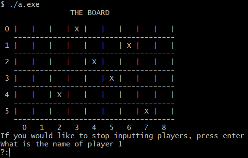

# Thomas O'Gara's Algorithms Portfolio

This project is an implementation of the popular board game Igel Argern. It is implemented in C, using no external libraries.

## Getting Started

To begin, please `git clone` the repository onto your local machine.

### Prerequisutes

There are a small number of prerequisites if you aim to **build and/or run** this project on your local machine.

* The GCC Compiler Collection.

#### C Compiler

The officially supported C compiler for this project is the GCC Compiler Collection. This can be found at [gcc.gnu.org](https://https://gcc.gnu.org/).
  
**Please ensure that the C compiler installed on your system is added to the PATH environment variable.
You must be able to run the `gcc` tool from the terminal in order to build and/or run this project.**

### Installation

Now that you have a C compiler installed and available via the terminal, you are ready to install the project from source.

#### Building the project from source

To build the project from source, run the following commands from the terminal:

1. If there exists a directory named `/out/`, remove its contents. Otherwise, create an empty directory named `/out/`.
2. Run the following command from the terminal

        gcc *.c -o out/main.exe

The build process is now complete.

## Deployment

### Running the program locally

#### Launching the program

Execue the following command from the terminal.

    ./out/main.exe

This will begin the execution the project code. If all goes well, you should see an empty board printed to the terminal.
